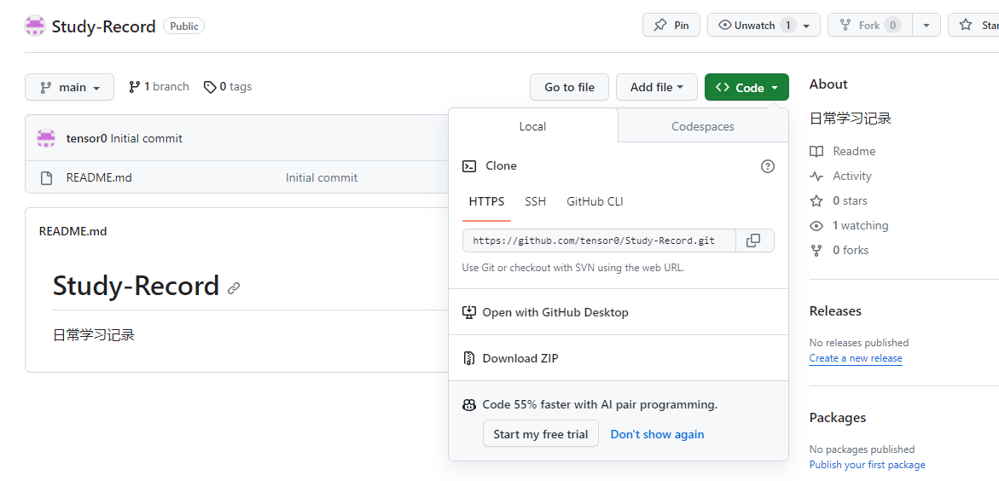

1. 首先要注册账号
2. 第一次使用git commit时(此时是commit到本地仓库)
    ```shell
    # 会报错:
    # *** Please tell me who you are.
    # git config --global user.email "you@example.com"
    # git config --global user.name "Your Name"
    # to set your account's default identity.
    # Omit --global to set the identity only in this repository.
    # 意思说：请告诉我你是谁，通过git config命令去设置账户的默认身份，省略--global的话设置仅在本地仓库生效

    #所以应该用下面两个命令来设置默认身份
    git config --global user.name "网名"
    git config --global user.email  "邮箱"
    
    # 设置完以上标识后就可以把暂存区内容commit到本地仓库了

    # 注意commit时使用以下命令可以直接输入此次提交备注而不用跳入vim界面输入提交备注
    git commit -m "备注"
    ```
2. 若想把本地仓库内容提交到远程仓库
    首先我们要先登录github，然后从github上仓库的Code按钮那里找到远程仓库的地址
    地址分为2种：
    1. 第一种是HTTPS URL
        ```shell
        # 输入以下命令将远程仓库的名字和地址匹配
        git remote add Mercury https://github.com/tensor0/Study-Record.git

        #此时再输入git remote 会弹出
        Mercury

        # 此时输入git push会弹出
        # fatal: The current branch main has no upstream branch.
        # git push --set-upstream Mercury main
        # To have this happen automatically for branches without a tracking upstream, see 'push.autoSetupRemote' in 'git help config'.
        # 意思是本地当前分支未设置上游分支，所以不知道把当前分支push到哪里去，所以应当设置当前分支的上游分支

        #将本地当前分支的上游分支设置为 Mercury用户关联地址的main分支
        git push -u Mercury main
        ```
        此时会弹出让你输入github用户名和密码，输入完成后会弹出
        ```shell
        info: please complete authentication in your browser...
        To https://github.com/tensor0/Study-Record.git
        ! [rejected]        main -> main (fetch first)
        error: failed to push some refs to 'https://github.com/tensor0/Study-Record.git'
        hint: Updates were rejected because the remote contains work that you do not
        hint: have locally. This is usually caused by another repository pushing to
        hint: the same ref. If you want to integrate the remote changes, use
        hint: 'git pull' before pushing again.
        hint: See the 'Note about fast-forwards' in 'git push --help' for details.
        ```
    2. 第二种是SSH URL
    
    ```shell
    # 只输入以下命令是不行的，因为git remote是显示远程仓库的用户名，但是在第一次提交远程仓库时，还未设置，远程仓库，所以此时输入git remote什么也不显示
    
    
    
    # 使用git remote add 来添加远程仓库
    git remote add ${远程仓库网址}

    
    ```

参考资料：
1. 创建Git本地仓库并同步远程Github
https://blog.csdn.net/qq_41185569/article/details/119731880

2. 【『教程』一看就懂！Github基础教程】 https://www.bilibili.com/video/BV1hS4y1S7wL/?share_source=copy_web&vd_source=a87169b88877fd501e8ba925a0512fde

3. git的安装与使用
https://zhuanlan.zhihu.com/p/607970211

4. github帮助文档
https://docs.github.com/zh/get-started/using-git/pushing-commits-to-a-remote-repository