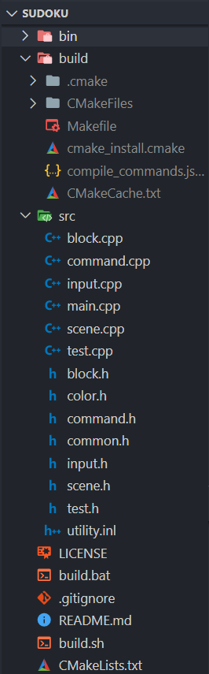

###Vscode配置
0. 区分编辑器、编译器、IDE：
    编辑器:
    就是处理文本（源码）的程序，写代码写的就是文本，编辑器可能提供智能提示、代码高亮等辅助功能，但不负责源码到二进制文件的操作；
    编译器:
    就是负责将源码文本翻译成计算机能够理解和执行的二进制文件的程序；
    集成开发环境（IDE，Integrated Development Environment ）:
    是用于提供程序开发环境的应用程序，包括了代码编辑器、编译器、调试器和图形用户界面工具。集成了代码编写、分析、编译、调试等一整套工具链。

1. vscode是什么：
    vscode定位代码编辑器
2. 搭建环境是什么：
    vscode定位代码编辑器，不是IDE，不包含编译功能，因此需要我们自己安装编译器、调试器等编译器套件，并使两者有效的配合起来，以实现快捷操作。**把这一整套工具链整合到一起的过程就是我们所说的搭建环境。**

**ok,到这里，我们就清楚要做什么了：获取编辑器 -> 获取编译套装(编译器、调试器、头文件库等) -> 做好两者之间的沟通工作(配置文件)**

####具体操作流程
1. 下载vscode编辑器
2. 下载编译器(Windows系统下载的是MinGW-w64)
3. 安装mingw，注意路径不要有中文
4. 安装完毕后，bin目录下很多可执行程序：
    gcc.exe 是C语言程序的编译器
    g++.exe 是C++语言的编译器
    gdb.exe 是用来调试程序的 debug 工具
    cpp.exe 是C预处理器(C PreProcessor),注意不是c++的编译器..https://www.zhihu.com/question/373613660
5. 然后，为了让程序能访问到这些编译程序，需要把它们所在的目录（我这里是C:\Program File\mingw64\bin，点击地址栏进行复制）添加到环境变量Path中。
(注：环境变量：环境变量是 Windows 系统中用来指定运行环境的一些参数，它包含了关于系统及当前登录用户的环境信息字符串。当用户运行某些程序时，系统除了会在当前文件夹中寻找某些文件外，还会到环境参数的默认路径中去查找程序运行时所需要的系统文件。)
6. 环境变量Path添加mingw的bin目录成功后，搜索打开cmd命令提示符，输入gcc --version(中间有空格）(或者g++ --version)，按回车 看是否安装成功
7. 安装成功后，重启电脑


**好了，我们的电脑里已经有了这两个东西了，他们是从不同的地方下载的，安装的位置也不同，目前两者之间还没有任何联系，接下来，我们应该去搭建起他们之间的桥梁了**

但是编译路径和文件结构相关，所以要先介绍一下文件结构

####文件结构
文件结构就是你组织文件夹、文件，决定他们怎样嵌套、怎样从属的方法。这一步是区分搭建的是语言学习环境还是实际项目开发环境的关键。这两者有什么区别呢？想想你写hello world时是怎样写的，你写了一个单文件，只有一个.c文件，然后你按下绿色三角进行编译运行生成.exe可执行文件，语言学习环境大都是这样的单文件编译运行调试，或者是涉及到简单的几个头文件和源文件的组合这样的多文件结构。而实际项目开发呢，实际中的一个小项目的目录结构可能长这样：

我们的语言学习环境不是这样的，我们用不到lib、build、makefile等文件夹/文件，我们的目录结构应当方便我们新建一个单文件，然后编译调试，这些文件还应当在一起以方便查看和管理


task.json
```json
{
    "version": "2.0.0",
    "tasks": [
        {//这个大括号里是‘构建（build）’任务
            "label": "build", //任务名称，可以更改，不过不建议改
            "type": "shell", //任务类型，process是vsc把预定义变量和转义解析后直接全部传给command；shell相当于先打开shell再输入命令，所以args还会经过shell再解析一遍
            "command": "gcc", //编译命令，这里是gcc，编译c++的话换成g++
            "args": [    //方括号里是传给gcc命令的一系列参数，用于实现一些功能
                "${file}", //指定要编译的是当前文件
                "-o", //指定输出文件的路径和名称
                "${fileDirname}\\bin\\${fileBasenameNoExtension}.exe", //承接上一步的-o，让可执行文件输出到源码文件所在的文件夹下的bin文件夹内，并且让它的名字和源码文件相同
                "-g", //生成和调试有关的信息
                "-Wall", // 开启额外警告
                "-static-libgcc",  // 静态链接libgcc
                "-fexec-charset=GBK", // 生成的程序使用GBK编码，不加这一条会导致Win下输出中文乱码
                "-std=c11", // 语言标准，可根据自己的需要进行修改，写c++要换成c++的语言标准，比如c++11
            ],
            "group": {  //group表示‘组’，我们可以有很多的task，然后把他们放在一个‘组’里
                "kind": "build",//表示这一组任务类型是构建
                "isDefault": true//表示这个任务是当前这组任务中的默认任务
            },
            "presentation": { //执行这个任务时的一些其他设定
                "echo": true,//表示在执行任务时在终端要有输出
                "reveal": "always", //执行任务时是否跳转到终端面板，可以为always，silent，never
                "focus": false, //设为true后可以使执行task时焦点聚集在终端，但对编译来说，设为true没有意义，因为运行的时候才涉及到输入
                "panel": "new" //每次执行这个task时都新建一个终端面板，也可以设置为shared，共用一个面板，不过那样会出现‘任务将被终端重用’的提示，比较烦人
            },
            "problemMatcher": "$gcc" //捕捉编译时编译器在终端里显示的报错信息，将其显示在vscode的‘问题’面板里
        },
        {//这个大括号里是‘运行(run)’任务，一些设置与上面的构建任务性质相同
            "label": "run", 
            "type": "shell", 
            "dependsOn": "build", //任务依赖，因为要运行必须先构建，所以执行这个任务前必须先执行build任务，
            "command": "${fileDirname}\\bin\\${fileBasenameNoExtension}.exe", //执行exe文件，只需要指定这个exe文件在哪里就好
            "group": {
                "kind": "test", //这一组是‘测试’组，将run任务放在test组里方便我们用快捷键执行
                "isDefault": true
            },
            "presentation": {
                "echo": true,
                "reveal": "always",
                "focus": true, //这个就设置为true了，运行任务后将焦点聚集到终端，方便进行输入
                "panel": "new"
            }
        }

    ]
}
```

参考：
作者：XE0CH47N
链接：https://zhuanlan.zhihu.com/p/147366852
来源：知乎