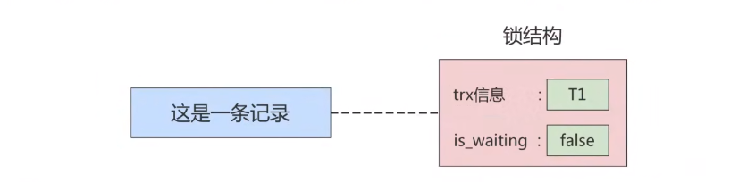

### 首先要明确几个概念
START TRANSACTION(事务的开启)后面可以跟随多个修饰符：
READ ONLY:只读事务
READ WRITE:读写事务
WITH CONSISTENT SNAPSHOT：启动一致性读
**若不显示指定事务的访问模式，那么该事务的访问模式是读写模式(READ WRITE)**

一旦事务进行了增删改操作，不管有没有提交，那么就一定会更新undo版本链。


### 事务id
分配事务id的时机:
对于只读事务:
只有在它第一次对某个用户的临时表执行增删改操作时才会为这个事务分配一个事务id，否则是不分配事务id的。
对于读写事务:只有在它第一次对某一个表(包括用户创建的临时表)执行增删改操作时，才会为这个事务分配一个事务id，否则是不分配事务id的。
有时，虽然我们开启了一个读写事务，但是这个事务中全是查询语句，并没有执行增删改操作的语句，这也就意味着这个事务并不会被分配一个事务id。
事务id大的说明事务启动时间更靠后(MVCC的read view会用到)
**注意：如果不为某个事物分配事务id，那么它的事务id为默认值0。**

### undolog
undolog版本链：每一个版本链只能同时有一个活跃(分配trx_id的，只读事务不算)事务(否则是脏写)


### MVCC
##### 为了解决什么问题：
MVCC为了提高数据库并发性能，更好的解决读-写冲突，做到即使有读-写冲突时，也能做到不加锁，非阻塞并发读，而这个读指的是快照读，而不是当前读。当前读实际上是一种加锁的操作，是悲观锁的实现。而MVCC本质是采用乐观锁思想的一种方式。
快照读：又叫一致性读，读取的是快照数据。不加锁的简单的select都属于快照读，即不加锁的非阻塞读。之所以出现快照读的情况，是基于提高并发性能的考虑，快照读的实现是基于MVCC，它在很多情况下，避免了加锁操作，降低了开销。
既然是基于多版本，那么快照读可能读到的并不一定是数据的最新版本，而有可能是之前的历史版本。
快照读的前提是隔离级别不是串行级别(读已提交和可重复读级别，读未提交不清楚，感觉是没有快照)，串行级别下会退化为当前读

MVCC也解决了快照读下的幻读问题，但是当前读下的幻读问题没有解决。
当前读的幻读问题用next-key(临键)锁解决

#### 靠什么实现：
隐藏字段，undo版本链，read view 

#### 在什么情况下适用：
RC(读已提交),RR(可重复读)两种隔离级别下适用。因为RU(读未提交)每次select去读最新版本的数据就好，SE(串行化)加锁访问，也不用read view。

##### Read View：
主要包含4个重要内容：
m_ids:在生成Read View时，当前系统中活跃的读写事务的事务id列表
min_trx_id:在生成Read View时，当前系统中活跃的读写事务的最小的事务id；也就是m_ids中的最小值
max_trx_id:在生成Read View时，系统应该分配给下一个事务的事务id值
creator_trx_id:生成该Read View事务的事务id(只有在对表中的记录进行insert、delete、update时才会为事务分配唯一的事务id，否则一个事务的事务id默认为0)

若访问的undolog的trx_id>=max_trx_id，则说明该版本的事务是在本身read view创建那一刻之后创建的事务(说明事务id根本还未分配，因为max_trx_id是指在生成Read View时，系统应该分配给下一个事务的事务id，所以若trx_id>=max_trx_id则说明生成Read View时，该事务还未启动)，所以不可访问


能不能在两个事务中交叉更新同一条记录呢？不能！这不就是一个事务修改了另一个未提交的事务修改过的数据，这是脏写。
InnoDB使用锁来保证不会有脏写情况发生，也就是在第一个事务提交了某条记录后，就会给这条记录加锁，另一个事务再次更新时就需要等待第一个事务提交了，把锁释放之后才可以继续更新。(是修改完后立即释放还是等到事务结束才释放？)所以undolog的相同的trx_id是连着的。

**所以同一个undolog链表只能最多有一个活跃事务？**


### 锁
### #MySQL并发事务访问相同记录
分为三种情况：
读-读：
读-读情况，即并发事务相继读取相同的记录。读取操作本身不会对记录有任何影响，并不会引起什么问题，所以允许这种情况的发生。
写-写：
写-写情况，即并发事务相继对相同的记录作出改动。在这种情况下会发生脏写的问题，任何一种隔离级别都不允许这种问题的发生。所以在多个未提交事务相继对一条记录做改动时，需要让他们排队执行，这个排队的过程其实就是通过**锁**来实现的。这个所谓的锁其实是一个内存中的结构，在事务执行前本来是没有锁的，也就说一开始是没有锁结构和记录进行关联的，如图所示：

当一个事务想对这条记录做改动时，首先会看看内存中有没有与这条记录关联的锁结构，当没有的时候就会在内存中生成一个锁结构与之关联。比如，事务T1要对这条记录做改动，就需要生成一个锁结构与之关联：


读-写：
读-写或写-读，即一个事务进行读取操作，另外一个事务进行改动操作。这种情况下可能发生**脏读，不可重复读，幻读的问题**

#### 读-写或写-读情况下脏读、不可重复读、幻读的解决方案
##### 方案一：读操作使用MVCC，写操作进行加锁
写操作进行加锁的原因是：
写操作肯定是针对最新版本的记录，读记录的历史版本和改动记录的最新版本本身并不冲突，也就是采用MVCC时，读-写操作并不冲突


##### 方案二：读、写操作都加锁
如果我们的一些业务场景不允许读取记录的旧版本，而是每次都必须去读取记录的最新版本。这样读取记录的时候就需要对其进行加锁操作，这样就意味着读操作和写操作也像写-写操作那样排队执行。

##### 对比
采用MVCC的方式：读-写操作彼此不冲突，性能更高
采用加锁的方式：读-写操作彼此需要排队执行，影响性能

一般情况下我们当然愿意采用MVCC来解决读-写操作并发执行的问题，但是业务在某些特殊情况下，要求必须采用加锁的方式执行。下面就讲解下MySQL中不同类别的锁。

#### 从数据操作的类型划分：读锁、写锁
对于数据库中并发事务的读-读情况并不会引起什么问题。对于写-写、读-写或写-读这些情况可能会引起一些问题，需要使用MVCC或者加锁的方式来解决它们。在使用加锁的方式解决问题时，由于既要允许读-读情况不受影响，又要使写-写、读-写或写-读情况中的操作相互阻塞，所以MySQL实现一个由两种类型的锁组成的锁系统来解决。这两种类型的锁通常被称为共享锁(Shared Lock，SLock)和排他锁(Exclusive Lock，X Lock)也叫读锁(readlock)和写锁(write lock)。

读锁 ：也称为 共享锁 、英文用 S 表示。针对同一份数据，多个事务的读操作可以同时进行而不会
互相影响，相互不阻塞的。

写锁 ：也称为 排他锁 、英文用 X 表示。当前写操作没有完成前，它会阻断其他写锁和读锁。这样
就能确保在给定的时间里，只有一个事务能执行写入，并防止其他用户读取正在写入的同一资源。


##### 1. 读操作

只要是有X锁存在，不管其他锁是S锁还是X锁，即不管是先加X锁再加S锁，还是先加S锁后加X锁，或者两个X锁，都不兼容。

##### 共享读锁(S锁)
```sql
select ... lock in share mode;
#或
select ... lock for share;
```

##### 排他读锁(X锁)
```
select ... for update;
```
##### 2. 写操作
##### 只能是排他写锁(X锁)
DELETE:
UPDATE:
INSERT:

#### 从数据操作的粒度划分：表级锁、页级锁、行锁
为了尽可能提高数据库的并发度，每次锁定的数据范围越小越好，理论上每次只锁定当前操作的数据的方案会得到最大的并发度，但是管理锁是很耗资源的事情（涉及获取、检查、释放锁等动作)。因此数据库系统需要在高并发响应和系统性能两方面进行平衡，这样就产生了“锁粒度(Lock granularity)”的概念。

对一条记录加锁影响的也只是这条记录而已，我们就说这个锁的粒度比较细;其实一个事务也可以在表级别进行加锁，自然就被称之为表级锁或者表锁，对一个表加锁影响整个表中的记录，我们就说这个锁的粒度比较粗

锁的粒度主要分为表级锁、页级锁和行锁。
#### 表级锁
InnoDB由于有行锁，所以InnoDB的表锁稍作了解即可，一般情况下InnoDB默认是不会对表添加表级别的S锁或者X锁的。但是
会添加元数据锁(metadata lock)

2. 意向锁 （intention lock）
    1. 意向锁的存在是为了协调行锁和表锁的关系，支持多粒度(表锁与行锁)的锁并存。

    2. 意向锁是一种不与行级锁冲突表级锁，这一点非常重要。

    3. 表明“某个事务正在某些行持有了锁或该事务准备去持有锁”

    意向锁要解决的问题:
    给更大一级别的空间示意里面是否已经上过锁

    意向锁分为两种：
    1. 意向共享锁（intention shared lock, IS）：事务有意向对表中的某些行加共享锁（S锁）
    2. 意向排他锁（intention exclusive lock, IX）：事务有意向对表中的某些行加排他锁（X锁）
    注：意向锁是由存储引擎 自己维护的 ，用户无法手动操作意向锁，在为数据行加共享 / 排他锁之前，
    InooDB 会先获取该数据行 所在数据表的对应意向锁 。
    如果事务想要获得数据表中某些记录的共享锁，就需要在数据表上添加意向共享锁。
    如果事务想要获得数据表中某些记录的排他锁，就需要在数据表上添加意向排他锁。
3. 自增锁（AUTO-INC锁）
    确保给主键赋值的时候是全局唯一的。
4. 元数据锁(metadata lock)
    解决了什么问题：
    解决了DDL和DML之间的一致性问题(保证DDL和DML操作互斥)

    具体使用：
    1. 当对一个表进行增删查改的时候，加元数据读锁(MDL)
    2. 当对一个表的结构进行变更时，加元数据写锁(MDL)

    小结：
    读锁之间不互斥，因此你可以有多个线程同时对一张表增删改查。读写锁之间、写锁之间是互斥的，用来保证变更表结构操作的安全性，解决了DML和DDL操作之间的一致性问题。不需要显式使用，在访问一个表的时候会被自动加上。

#### 行锁

需要明确的几个细节：
**行锁是在语句执行时才加上的，不是事务开始就加上，但释放是统一在事务结束时才释放**
事务有一致性,保持执行状态的一致，脏读，不可重复读，幻读都破坏了一致性。也就是说事务从开始到结束期间，读取到的数据库状态是一致的(数据不会变),所以加了锁之后，不应当在事务commit或者rollback前释放锁。
例子：
现在有A和B两个事务，若A事务加X锁修改一条记录并释放，但是还未提交或者回滚，那么此时B也能修改该条记录，如果B提交事务，A事务rollback，则B事务发生脏写。
因此，事务的锁是两阶段协议(2PL),事务所有的锁都是在commit或者rollback后释放？

两阶段锁（Two-Phase Locking）
https://zhuanlan.zhihu.com/p/480379228


### 第三讲：事务隔离
（评论区）
1. 视图理解为数据副本，每次创建视图时，将当前『已持久化的数据』创建副本，后续直接从副本读取，从而达到数据隔离效果。

    存在视图的 2 种隔离级别：
    1. 读提交
    2. 可重复读

    读提交：在每一条 SQL 开始执行时创建视图，隔离作用域仅限该条 SQL 语句。

    可重复读：事务启动时创建视图，因此，在事务任意时刻，对记录读取的值都是一样的。

    其他 2 种无视图的隔离级别：
    1. 读未提交
    2. 串行化

    读未提交：直接返回记录最新值。

    串行化：通过读写锁来避免并行访问。
    读-读：允许并发执行
    读-写：只能串行
    写-写：只能串行

2. 本文通读多次，关于视图一直卡着，希望老师能点拨下，谢谢！
    问题1、本文中提及的视图是不是数据库里常说的那个结构--“视图”(view)？
    以下假设1成立。
    前提：视图粗暴的理解为一条select返回的结果集； 假设在一个事务T（可重复读隔离级别）中有3个操作A,B,C，且A与C都是查询表t_user的同一条记录R，另外如本文所述在启动事务T时就会创建视图（记为视图V）。
    问题2、视图V在事务T启动时创建，是不是会将结果集缓存起来，以提供给操作B和C使用？即在执行操作B,C时不会再去执行视图V的select语句？
    问题3、缓存的粒度问题； 假设问题2成立，视图V的结果集是只有记录R，还是整张t_user表，或者索性整个库？ 为什么?
    问题4、题外话，我本人非常喜欢林老师的这个专栏，只怨自己订购的太晚了（相信有很多我这种读者），到2月27本课程已经结束了。我想替所有后续订阅本专栏的读者问问林老师，会不会继续回复大伙的留言？
 
    作者回复: 
    1&2  这两个不是相同的概念。 “一条select返回的结果集”是视图（虚拟表），我们这里说的视图，是InnoDB的一致性视图。08篇有解释这两个概念的区别；
    3. 整个库，这个是可重复读的定义。当然这里不建议称为“缓存”，还是称为“视图”更严格些
    4. 会继续关注和回复评论的。只要是跟文章内容相关（主要是为了方便其他同学看评论区聚焦）、其他评论没有问过的问题，都会回答。
3. 第八讲的某一段话的笔记
    
    