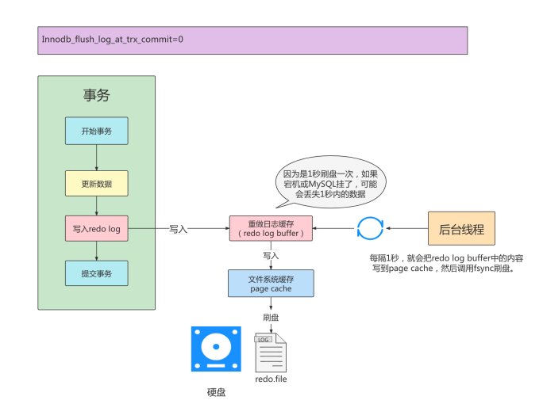

###数据库原理
一些常用名词的勘误：
中文：
```
完整性:可靠性(integrity)
参照完整性：引用可靠性(referential integrity)


```
1. 数据库的完整性(**可靠性：integrity**)
    作用：
    一个数据库的落地最基本的是保证数据库中的数据在逻辑上的一致性、正确性和可靠性。所以说数据完整性的作用就是防止无效数据或错误数据进入数据库
    数据库的完整(可靠)性规则：
    ```
    实体完整性：是指表中主键属性的值不能为空且不能重复。
    参照完整性：外键属性的取值要么为空，要么是主键属性域中的值。
    用户自定义完整性：用户定义的属性取值必须在自己定义的范围和域内
    ```
    1. 实体完整(可靠)性
    ```
    实体完整性：实体完整性是指一个关系中所有主属性（即主码的属性）不能取空值。
    所谓“空值”就是“不知道”或“无意义”的值。
    如主属性取空值，就说明某个不可标识的实体，这与现实世界的应用环境相矛盾，因此这个实体一定不是完整的实体。
    ```
    2. 参照完整(可靠)性(**referential integrity:引用可靠性**)
    ```
    参照完整性是指来自两个或多个表的数据具有一致且准确的数据。
    这可以通过确保外键值与主键中的值匹配来实现
    ```
    3. 域完整性
    ```
    域完整性是指数据库中输入的真实性和准确性。
    这涉及确定列的标准数据类型和格式。
    例如，数据库可能要求所有货币条目仅包含 1 位小数，而不包含逗号
    ```
    4. 用户自定义完整(可靠)性。
    ```
    用户定义的完整性需要用户创建规则以满足其需求。
    通常，实体、引用和域完整性可能不足以确保数据准确性。
    因此，用户必须实现自己的要求
    ```
    参考：https://zhuanlan.zhihu.com/p/545716910
         https://zhuanlan.zhihu.com/p/415535561
         https://zhuanlan.zhihu.com/p/374257212
         https://zhuanlan.zhihu.com/p/433988083
        数据库完整性-百度百科
2. 

###MySQL
####事务
1. (为什么要有事务):现实世界的状态转换需要满足ACID四个特性，而数据库为了模拟现实世界的状态转换，把保证ACID四个特性的数据库操作叫做事务。p299
2. (事务是什么)事务的四个特性：原子性、一致性、隔离性、持久性 
    1. 原子性：该事务不可分割(要么全做，要么全不做) p295
    2. 隔离性：两个不同的事务不会互相影响(两个不同的状态转换不会互相影响) p295
    3. 一致性：数据库是现实世界的一个映射，数据库中的约束和现实世界中的约束是一致的(数据库的状态和现实世界的状态是一致的) p297
    4. 持久性：当事务提交后，应当保证该事务的状态转换是持久的 p298
3. 事务的五个状态：p299
    1. 活动的
    2. 部分提交的
    3. 失败的
    4. 中止的
    5. 提交的

事务的四种特性由什么来保证实现：
原子性：undo日志
一致性：
隔离性：锁机制
持久性：redo日志

**数据库的修改并不是直接修改磁盘中的数据，而是先修改内存中的数据，等到合适时机再刷盘，如果在事务执行过程中，还没有提交，并且还未来得及刷盘但是数据库宕机了，重启后就修改丢失，相当于什么都没有做(不用redo log，因为commit之前不需要持久性)。**
#####redo日志(保证持久性)
1. redo日志的原因：
    事务包含 持久性 的特性，就是说对于一个已经提交的事务，在事务提交后即使系统发生了崩溃，这个事务对数据库中所做的更改也不能丢失。
    但是事务提交(commit)后并不是直接刷入到磁盘中，而是在内存中修改，但是如果数据库在内存中修改之后还没来得及刷入磁盘中崩溃了，那么这段数据就丢失了，和持久性相违背。
    所以我们如何保证这个持久性？首先想到的是一个简单的做法 ：在事务提交完成之前把该事务所修改的所有页面都刷新到磁盘，但是这个简单粗暴的做法有些问题。因为
    1. 修改量与刷新磁盘工作量不成比例
    2. 随机I/O刷新较慢
2. redo日志的组成
    1. 内存层面：
        重做日志的缓冲 (redo log buffer) ，保存在内存中，是易失的
    2. 硬盘层面：
        重做日志文件 (redo log file) ，保存在硬盘中，是持久的

3. redo的整体流程：
    

但是redo日志先记录到redobuffer中，只有redo日志从redobuffer中刷到硬盘中形成redo log file，才可以真正的持久化。
可是在redo buffer和硬盘中还有个操作系统的page cache，redo log刷盘其实指的是写到操作系统的cache中，再从操作系统的cache中刷盘道硬盘中

**commit提交后redo log刷盘分为三种情况**
1. 刷盘到page cache同时把page cache也刷到硬盘中(日志真正刷盘成功才会显示commit 成功)
```
每次执行事务，提交commit时，会立即将MySQL内存的中的数据写入到文件系统缓存中，文件系统立即将缓存写入到磁盘中。直到确实将数据写入到磁盘中，commit命令才算执行成功。当值为1时，数据写入很安全，保证了数据入库的安全性 
```

2. 写到redo buffer中就不管了，等后台线程默认每隔1秒往page cache中写，并把page cache刷盘

3. 把redo buffer中的数据写到page cache中就不管了，page cache什么时候刷盘看操作系统自己
 


```
上述情况只有1保证了持久性，
2中如果数据库崩溃或者操作系统崩溃则会丢失最多1秒的数据(因为此时虽然commit成功，但是redo log只在redo buffer中，还未写入page cache，数据库崩溃就没了，更不要说操作系统崩溃了)
3中如果数据库崩溃没有事，仍能保证持久性，但是如果操作系统崩溃，则不能保证持久性(因为此时虽然commit成功，但是redo log只在page cache中，还未写入硬盘，操作系统崩溃就没了)
```


参考资料: 
https://baijiahao.baidu.com/s?id=1660511339516745571&wfr=spider&for=pc

4. 写入redo log buffer 过程 宋红康视频p171
    1. Mini-Transaction：mtr
    一个事务可以包含若干条语句，MySQL把对底层页面的一次原子访问的过程称为Mini-Transaction,简称mtr，每一条语句其实是由若干个mtr组成，每一个 mtr 又可以包含若干条redo日志(因为redo记录的是)，画个图表示它们的关系就是这样
    

###undo日志(保证原子性)
1. undo日志的原因：
    事务需要保证 原子性 ，也就是事务中的操作要么全部完成，要么什么也不做。但有时候事务执行到一半会出现一些情况，比如：
情况一：事务执行过程中可能遇到各种错误，比如 服务器本身的错误 ， 操作系统错误 ，甚至是突然 断电 导致的错误。
情况二：程序员可以在事务执行过程中手动输入 ROLLBACK 语句结束当前事务的执行。
以上情况出现，我们需要把数据改回原先的样子，这个过程称之为 回滚 ，这样就可以造成一个假象：这
个事务看起来什么都没做，所以符合 原子性 要求。
2. undo日志的作用：
    1. 回滚数据
    2. MVCC
3. undo的存储结构

###锁(保证隔离性)
1. 