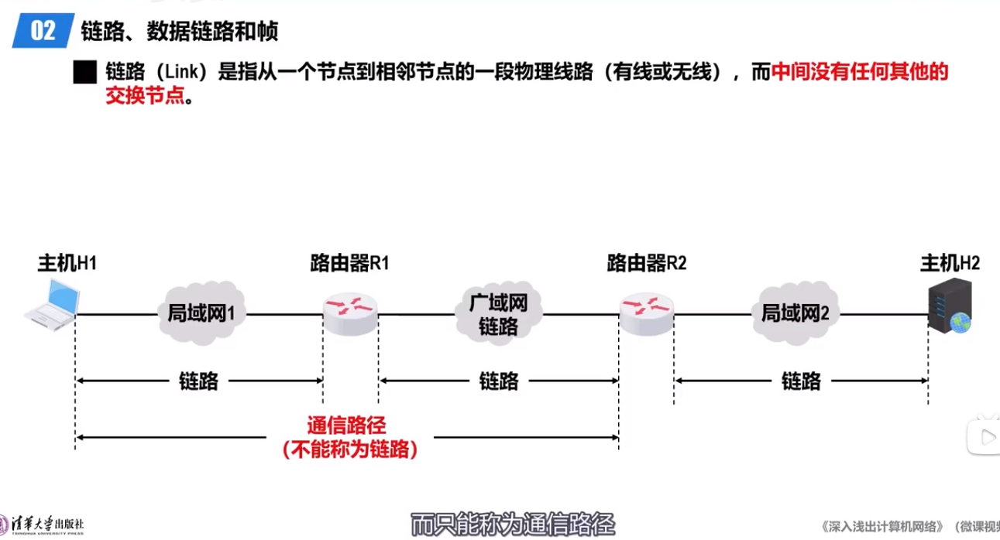
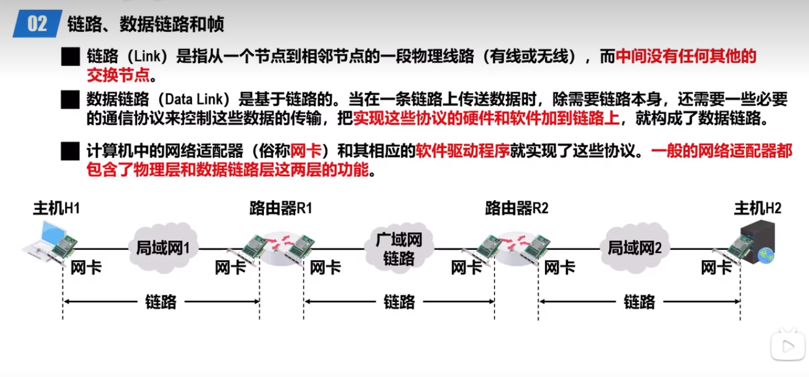
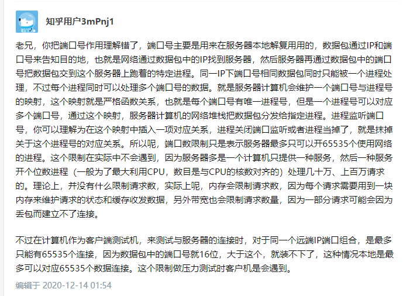

### 名词缩写：
**PDU(Protocol Data Unit):协议数据单元**

### 数据链路层
1. **链路：是指从一个节点到相邻节点的一段物理路径(有线或无线),而中间没有任何其他的交换节点。**
2. 数据链路：数据链路是基于链路的。当在一条链路上传输数据时，除了需要链路本身，还需要一些必要的通信协议来控制这些数据的传输，把实现这些协议的硬件和软件加到链路上，就构成了数据链路。
3. 计算机中的网卡和其相应的软件驱动程序就实现了这些协议。一般的网卡都包含了物理层和数据链路层这两层的功能。

### 网络层
ip数据报的发送和转发流程：

### 运输层

伪首部的作用：
1. 历史原因(曾经想通过加密算法把TCP/IP协议中重要的一些数据选项进行加密，这样可以保证数据的完整性，把源IP、目的IP等重要的数据选项组合到一起（也就是pseudo header）计算出来一个校验码，然后对这个校验码加密传输，这样就避免中间的“破坏者“来干扰、修改我们的数据报，但是最终没有实现，不过伪首部被保留了下来)
2. 当IP头校验和和IP地址被更改后发送到错误的主机，如果此时校验和仍然正确(存在这种可能)，错误的主机会接收这个包，但是在运输层可以再次检验这个包是否真的是属于该主机
https://www.zhihu.com/question/369434818
和
https://blog.csdn.net/liuxingen/article/details/45459313
和
https://stackoverflow.com/questions/359045/what-is-the-significance-of-pseudo-header-used-in-udp-tcp
注：伪首部并不真的添加到数据报中传输，只是添加到头部进行校验和计算，计算后，传输的数据报并没有伪首部(对面接收的时候计算校验和也是这样计算)

udp是面向报文的，若一次发送的报文大于udp实体报文的最大长度2^16(65535)字节,会发生什么：
https://www.zhihu.com/question/559766244

udp报文长度过大，会在网络层(ip)进行分片，如果在网络层(ip)分片，由于网络波动，怎么判断某个片是丢失了还是因为网络延迟到的比较慢？
其实这是网络层的任务：只有整个片完整传过来后才会向上交付给tcp模块或者udp模块，如果该分片在一定时间内没有完整收到，则会丢弃，对于传输层来说就是传输的数据丢失了，根本意识不到是在哪里丢失，或是什么原因丢失(也没有必要考虑)。如果完整收到同一组分片，则把他们完整组装起来再向上交付给传输层的模块，这样对于传输层来说就像一次性完整接收到了一个udp报文一样。
也就是网络层对传输层完全透明。
https://www.zhihu.com/question/61924360/answer/208726180

Linux操作系统中，TCP连接数量还受到端口数量限制，由于端口号只有1-65535，所以最大TCP连接数也只有65535个(包括系统端口1-1024)

电路交换：本质上是面向连接的通信系统。电路模式通信保证了恒定的带宽可用，并且比特流或字节流数据将以恒定的延迟按顺序到达。交换机在电路建立阶段被重新配置。(wiki)
**面向连接**：基于连接的意思，连接是什么，连接是确保数据以正确的顺序传递到上层通信层(wiki)。连接指的是逻辑上的连接，面向连接和无连接它们的本质区别在于，对无连接协议来说，每个分组的处理都独立于所有其他分组，而对面向连接的协议来说，协议实现则维护了与后继分组有关的状态信息。而三次握手，正是建立连接的操作。(知乎)
(根据chatgpt总结的)一般情况下，维护的状态信息是保证可靠性的，所以面向连接一般和可靠性放在一起，但是实际上，若维护状态信息但是不保证可靠性也是可以的。
**可靠的**：注意可靠和面向连接完全不是一个概念，可靠和面向连接没有任何关系，可靠指的是可靠交付，保证数据无差错，不丢失，不重复且有序。
**全双工**：和可靠的还有面向连接完全不是一个概念，并且没有任何关系，全双工指的是允许通信双方可以同时收发数据(并不是只能单向通信(单工)或者虽然可以双向通信但是某一个时刻只能朝一个方向通信(半双工))
**面向字节流**：是基于字节流的意思。字节流是什么，指的是虽然应用层传给运输层的数据是一个数据块，但是在tcp看来，这个数据仅被看做一连串的无结构的字节流(封装或解封的时候并不考虑数据的逻辑结构)。
